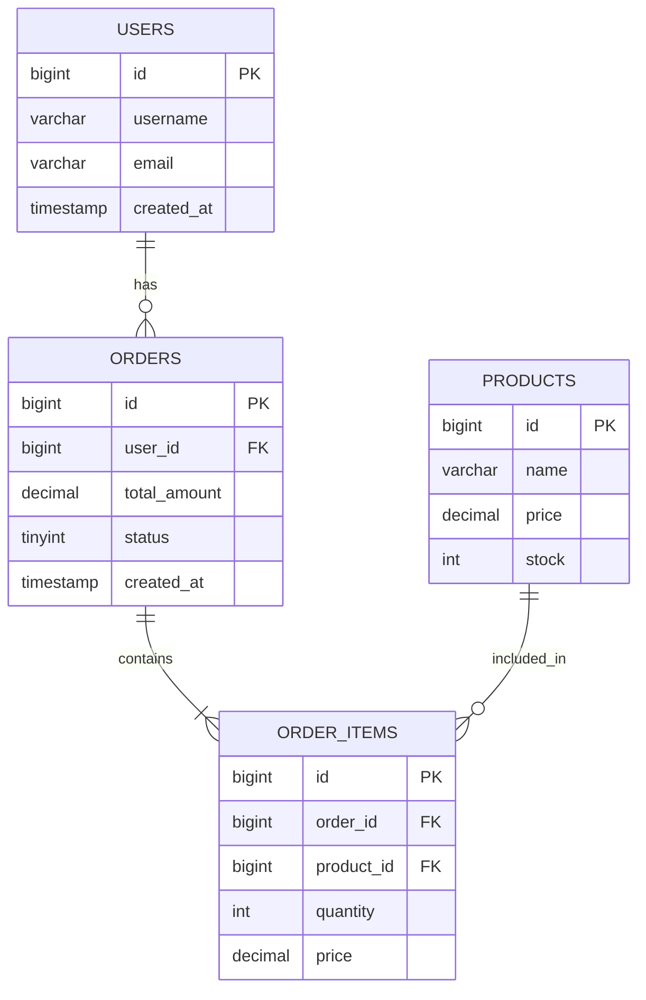

# 输出格式规范

## 文档结构

数据库设计文档应包含以下部分：

1. **概述** - 项目背景和设计目标
2. **业务分析** - 业务实体和关系分析
3. **数据库设计** - 表结构设计
4. **关系图** - ER图（使用Mermaid格式）
5. **索引设计** - 索引说明
6. **设计说明** - 设计思路和注意事项

## 表结构输出格式

### 标准格式

```markdown
### 表名 (table_name)

**说明**: 表的业务含义和作用

**字段列表**:

| 字段名 | 类型 | 约束 | 默认值 | 说明 |
|--------|------|------|--------|------|
| id | BIGINT UNSIGNED | PRIMARY KEY, NOT NULL, AUTO_INCREMENT | - | 主键ID |
| user_id | BIGINT UNSIGNED | NOT NULL | - | 用户ID |
| status | TINYINT | NOT NULL | 1 | 状态：1-正常，2-禁用 |
| created_at | TIMESTAMP | NOT NULL | CURRENT_TIMESTAMP | 创建时间 |
| updated_at | TIMESTAMP | NOT NULL | CURRENT_TIMESTAMP | 更新时间 |

**索引**:
- PRIMARY KEY (id)
- INDEX idx_user_id (user_id)
- INDEX idx_status (status)

**关联关系**:
- 关联 users 表（user_id -> users.id），一对多关系
```

### SQL建表语句格式

```sql
CREATE TABLE table_name (
    id BIGINT UNSIGNED NOT NULL AUTO_INCREMENT PRIMARY KEY COMMENT '主键ID',
    user_id BIGINT UNSIGNED NOT NULL COMMENT '用户ID',
    status TINYINT NOT NULL DEFAULT 1 COMMENT '状态：1-正常，2-禁用',
    created_at TIMESTAMP NOT NULL DEFAULT CURRENT_TIMESTAMP COMMENT '创建时间',
    updated_at TIMESTAMP NOT NULL DEFAULT CURRENT_TIMESTAMP ON UPDATE CURRENT_TIMESTAMP COMMENT '更新时间',
    INDEX idx_user_id (user_id),
    INDEX idx_status (status)
) ENGINE=InnoDB DEFAULT CHARSET=utf8mb4 COLLATE=utf8mb4_unicode_ci COMMENT='表说明';
```

## ER图格式（Mermaid）

### 基本语法



### 关系表示

- `||--o{` : 一对多（一个用户有多个订单）
- `||--||` : 一对一
- `}o--o{` : 多对多（通过中间表）

### 注意事项

- 表名使用大写
- 字段名使用小写+下划线
- PK表示主键，FK表示外键（虽然不设置外键约束，但要标注）
- 关系线要清晰标注关系类型

## 索引设计说明格式

```markdown
## 索引设计说明

### users 表

1. **PRIMARY KEY (id)**
   - 类型: 主键索引（聚簇索引）
   - 用途: 主键，自动创建
   - 性能影响: 无负面影响

2. **UNIQUE INDEX uk_email (email)**
   - 类型: 唯一索引
   - 用途: 确保邮箱唯一，加速邮箱查询
   - 性能影响: 轻微影响写入性能

3. **INDEX idx_status (status)**
   - 类型: 普通索引
   - 用途: 加速按状态查询和过滤
   - 性能影响: 轻微影响写入性能

### orders 表

1. **INDEX idx_user_id (user_id)**
   - 类型: 普通索引
   - 用途: 加速按用户ID查询订单
   - 性能影响: 轻微影响写入性能

2. **INDEX idx_status_created (status, created_at)**
   - 类型: 复合索引
   - 用途: 加速按状态和创建时间查询和排序
   - 覆盖场景: WHERE status = ? ORDER BY created_at DESC
   - 性能影响: 中等影响写入性能
```

## 设计说明格式

```markdown
## 设计说明

### 设计思路

1. **用户表设计**
   - 使用自增ID作为主键，保证插入性能
   - 邮箱和用户名设置唯一索引，确保唯一性
   - 使用软删除（deleted_at），保留历史数据

2. **订单表设计**
   - 订单号使用唯一索引，支持快速查询
   - 金额使用DECIMAL类型，确保精度
   - 状态字段使用TINYINT，节省存储空间

3. **关联关系设计**
   - 不设置数据库外键约束，由应用层维护数据完整性
   - 所有关联字段都创建索引，提高查询性能
   - 使用中间表处理多对多关系

### 性能考虑

1. **索引策略**
   - 为所有外键字段创建索引
   - 为频繁查询的字段创建索引
   - 使用复合索引优化常见查询模式

2. **字段类型优化**
   - 选择最小合适的类型
   - 金额字段使用DECIMAL而非FLOAT
   - 时间字段使用TIMESTAMP支持时区

3. **扩展性考虑**
   - 预留扩展字段（如：extra_info JSON）
   - 支持水平拆分（按时间或ID范围）
   - 考虑数据归档策略

### 注意事项

1. **数据完整性**
   - 虽然不设置外键约束，但要在应用层确保数据完整性
   - 删除操作要考虑级联删除逻辑
   - 唯一性约束要在应用层也进行校验

2. **查询优化**
   - 避免全表扫描
   - 合理使用索引
   - 考虑分页查询的性能

3. **维护性**
   - 字段注释要清晰完整
   - 表结构变更要有版本管理
   - 定期审查索引使用情况
```

## 完整文档示例

```markdown
# 电商系统数据库设计文档

## 1. 概述

本文档描述电商系统的数据库设计，包括用户、商品、订单等核心业务模块。

### 设计目标

- 支持高并发读写
- 保证数据完整性
- 便于扩展和维护
- 优化查询性能

## 2. 业务分析

### 2.1 业务实体

- **用户 (User)**: 系统用户，包含注册、登录、个人信息管理
- **商品 (Product)**: 商品信息，包含价格、库存、分类
- **订单 (Order)**: 用户下单信息
- **订单项 (OrderItem)**: 订单中的商品明细

### 2.2 实体关系

- 用户 - 订单: 一对多
- 订单 - 订单项: 一对多
- 商品 - 订单项: 一对多

## 3. 数据库设计

### 3.1 用户表 (users)

[表结构说明...]

### 3.2 订单表 (orders)

[表结构说明...]

## 4. 数据库关系图

[ER图...]

## 5. 索引设计

[索引说明...]

## 6. 设计说明

[设计思路和注意事项...]
```

## 输出检查清单

- [ ] 是否包含所有表的完整结构？
- [ ] 字段类型、约束、默认值是否完整？
- [ ] 是否包含ER关系图？
- [ ] 索引设计是否说明清楚？
- [ ] 设计思路是否阐述清楚？
- [ ] SQL建表语句是否可以直接执行？
- [ ] 文档格式是否规范统一？
