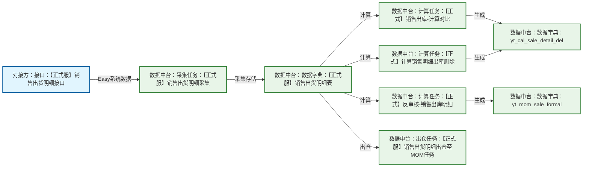

# 销售出库数据中台架构图

## 数据流架构

## 核心数据流程

### 主要流程（核心业务流）
1. **数据源**：【正式服】销售出货明细接口（Easy系统）
2. **数据采集**：【正式服】销售出货明细采集
3. **数据存储**：【正式服】销售出货明细表
4. **数据出仓**：【正式服】销售出货明细出仓至MOM任务

### 计算任务流程（并行处理）
- **【正式】销售出库-计算对比** → 生成 **yt_cal_sale_detail_del**
- **【正式】反审核-销售出库明细** → 生成 **yt_mom_sale_formal**
- **【正式】计算销售明细出库删除** → 生成 **yt_cal_sale_detail_del**

## 详细说明

### 1. 数据源（Easy系统）
- **【正式服】销售出货明细接口**：Easy系统提供的销售出货明细数据接口

### 2. 数据字典
- **【正式服】销售出货明细表**：存储从Easy系统采集的原始销售出货明细数据
- **yt_cal_sale_detail_del**：销售明细出库删除计算表
- **yt_mom_sale_formal**：MOM销售正式表

### 3. 任务说明
- **【正式服】销售出货明细采集**：从Easy系统采集销售出货明细数据
- **【正式服】销售出货明细出仓至MOM任务**：将数据出仓到MOM系统
- **计算任务**：对原始数据进行各种业务计算和处理

## Excel格式建议

### 工作表1：核心数据流
| 序号 | 源节点 | 目标节点 | 数据源系统 | 环境 | 频率 | 状态 |
|------|--------|----------|------------|------|------|------|
| 1 | 销售出货明细接口 | 销售出货明细采集 | Easy系统 | 正式服 | 每日 | 启用 |
| 2 | 销售出货明细采集 | 销售出货明细表 | - | 正式服 | 每日 | 启用 |
| 3 | 销售出货明细表 | 销售出货明细出仓至MOM任务 | - | 正式服 | 每日 | 启用 |

### 工作表2：计算任务清单
| 任务名称 | 任务类型 | 输入表 | 输出表 | 环境 | 状态 | 备注 |
|----------|----------|--------|--------|------|------|------|
| 销售出库-计算对比 | 计算任务 | 销售出货明细表 | yt_cal_sale_detail_del | 正式 | 启用 | 数据对比计算 |
| 反审核-销售出库明细 | 计算任务 | 销售出货明细表 | yt_mom_sale_formal | 正式 | 启用 | 反审核处理 |
| 计算销售明细出库删除 | 计算任务 | 销售出货明细表 | yt_cal_sale_detail_del | 正式 | 启用 | 删除逻辑计算 |

### 工作表3：数据字典
| 表名 | 表类型 | 数据来源 | 用途 | 环境 | 状态 |
|------|--------|----------|------|------|------|
| 销售出货明细表 | 原始数据表 | Easy系统 | 存储原始销售出货数据 | 正式服 | 启用 |
| yt_cal_sale_detail_del | 计算表 | 计算任务 | 销售明细出库删除数据 | 正式 | 启用 |
| yt_mom_sale_formal | 计算表 | 计算任务 | MOM销售正式数据 | 正式 | 启用 |

### 工作表4：接口清单
| 接口名称 | 系统来源 | 接口类型 | 环境 | 状态 | 备注 |
|----------|----------|----------|------|------|------|
| 销售出货明细接口 | Easy系统 | REST API | 正式服 | 启用 | 提供销售出货明细数据 | 