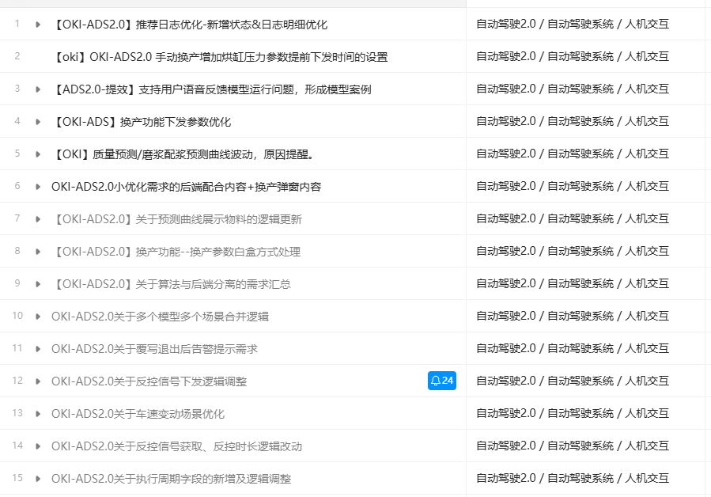
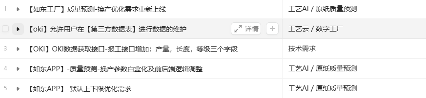
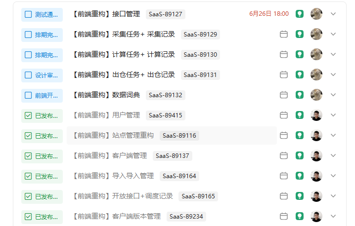
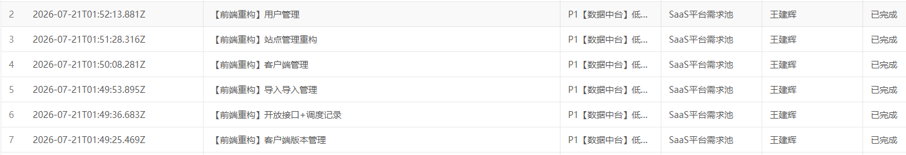

# 一、个人目标完成情况总结

## 1、目标完成情况

### O1（商业目标）：现金流转正

* KR1：支撑境外业务项目和产品功能开发

  * KR1：境外业务

    * 开发

      * AIOT

        * DOP 新底座打造 https://www.teambition.com/task/6a1814bdb573062a6f730d3c

        

        

        

    * 交付（850万）

      * OKI TIP1 收尾

      

* KR2：国内业务（回款1250万）

  * 交付（650万）

    * 桂林奇峰纸业-3月初验收

    * 保定雨森APS-5月底验收

    * 甘肃雨森 项目开发

    * 其他：

      * 黔玻-待重启

      * 燕塘-深化应用（指标校准、WMS的接口对接、剩余数采校准）-待启动

### O2（客户目标）：AI打透

* KR1：工艺AI

  * OKI TIP1  20小时自主反控

  * 如东夜班全面反控

    * 支持如东AI诊断反控

    * 支持如东换产处理

    

### O3（内部技术项目）：基础建设完善与债务偿还

* KR3：【重点3】数据对接中台（技术债务已非常重）-优化完善，提升交付效率（主要工作：前端重构、执行引擎、告警能力、性能提升），50-70人天 - 王建辉 6月30号前完成

  * P1 前端界面重构：废弃 低代码 平台，采用Vue3重构中台界面，可利用AI协助处理 （耗时20天-共19个页面+脚手架），可根据优先级考虑分批次改造：目前由于低代码平台存在BUG导致中台已经无法支持任何的前端修改，无法新增功能也无法修改功能；注意需考虑 国际化 。4月30号前 - 主体功能已完成

    

  * P1 支持执行引擎：支持python语言，提高中台配置效率，耗时13天（前端1天，后端10天，开发自测2天）：着重用于解决使用SQL进行数据处理时，使用不便捷、复杂度高、性能低；-- 进行中 `@张恒`

  * P1 告警功能优化：支持告警过滤功能，增强告警能力，提高中台的风险预警能力（特别是任务停了需能感知到），耗时3天（前端1天，后端2天，测试1天）5月30号前 --- 进行中 `@邓斌`

  * P2 支持数据批量出仓：提高中台的出仓性能，耗时9天（后端7天，测试1天）6月30号 已暂缓 `@王建辉`

  * P4 给交付团队做培训，含帮助手册及视频（拆多章节），普及如何合理的使用数据对接中台，3人天

  * P4 采集任务写入数据优化：提高中台的性能以及支持大批量的数据写入（数据比对性能优化），耗时3天 6月30号 进行中 `@张恒`

  * p3 数据对接中台：支持绝对正序的出仓任务，当前面的记录执行失败时，后面全部阻塞。测试中 `@王建辉`

  * p3 配合修改测试环境MySQL数据对接中台的临时表，改完之后运维才能把测试库MySQL迁移至使用OceanBase。（注意不要影响到各个生产环境，代码可以先不合并至master 或者 做开关配置）5月30号前 已暂缓

  * H2：支持AI生成任务生成、接口生成、数据词典生成、Python语言脚本，提供标准化rules、skills与promt示例（注意：数据安全、性能、易维护性）

* KR5：其他，20人天（简单实现）-45人天（比较完善）

  * 【常规1】ADS纳入发布平台管理（版本管理、数据库与对象存储等变更管理、云边协同、词条管理与修改）、测试批量发布平台融合，5-15人天 - 邓斌 ​王建辉 4月30号 已完成

  * 【常规2】 国际化 -多语言词条管理（DOP/ADS），5-10人天- 杨子烁 ​王建辉 4月30号 阻塞中

* product和cloud-platform服务 启动慢问题处理 王建辉 3月30号

* O4（组织目标）：大产研AI全链路打通（缩短与客户的距离，缩短工作流)

  * O4（组织目标）：系统构建组织AI能力，为超级全能个人筑基

    * KR1：全栈开发/ 跨界融合 ，打造超级全能个人

      * 原后端全员，跨界“前端”技术栈

        * 目标：至少完成4个低复杂度需求 + 1个中复杂度需求 `@王建辉`

        

      * 一人团队

        * 目标：完成至少2个全链路开发的需求

        

        

    * KR2：AI提效相互赋能分享（含全员落实最佳实践），每人不少于2次

      * [ AI使用上的一些实践处理 --- 王建辉](https://lr6n20hguf.feishu.cn/wiki/K3mPw71VjiuTNRkG6ErcC669nvc)

      * [ 关于核心功能的AI 化（OpenSpec + Superpowers + OMO  + Harness 等）的使用](https://lr6n20hguf.feishu.cn/wiki/S7FEw5Lv3ieAkbk9ibdc3gAlnld)

      * [ AI 在国际化处理中的使用](https://lr6n20hguf.feishu.cn/wiki/ZB1fwsRQviqEyikpPKPcvw8GnZc)

    * KR3：技术和业务的知识广度与深度提升，能快速清晰“定义问题”及借助AI解决问题

      * 深入理解业务领域和系统架构，不局限于单一开发角色，提升从业务目标、需求分析到技术方案设计的综合能力；

      * 利用AI工具辅助业务分析、代码理解、技术调研和方案设计，提升对复杂系统和历史代码的快速理解能力；持续沉淀业务知识、技术方案、架构决策及AI实践文档，形成个人及团队可复用资产。

      * 协助搭建 AI中转平台

## 2、分析原因

（1）O1项目层面：ADS目前依旧存在部分需求返工的情况，因交付在试验过程中不断发现新的问题而调整优化功能，导致无法彻底结束ADS的功能研发阶段，目前还有部分需求在研发过程中；

（2）O2国际化实现，目前只实现界面的基本增删改，涉及增删改翻译后面修改各项目翻译和在线读取翻译表实现耗费工时较多，无时间投入

（3）O3实际上，下半年很多紧急的需求，一直在支持多个项目开发需求，无时间投入到跨界大数据的实际实践工作中

## 3、改进措施

### （1）提升需求分析质量，降低研发返工成本

产品需求是研发投入和工时消耗的主要来源之一，需求输入的准确性和完整性直接影响研发效率及交付质量。后续将避免单纯追求快速上线，在需求阶段投入更多时间进行业务背景分析、目标确认和方案评审，确保需求边界、业务场景和实现方式充分明确后再进入开发阶段。

同时建立更完善的需求评审机制，对于评审过程中发现的问题，允许需求重新梳理和再次评审，确保需求质量达到开发标准，减少因前期理解不足导致的重复开发和返工。

### （2）加强跨技术领域能力建设，提升全栈交付能力

持续推进前后端技术能力融合，前端开发能力已逐步成为研发人员的基础能力。

目前对于大部分非复杂前端需求，已实现由后端研发自主完成前端开发，不再完全依赖前端资源，提高需求响应速度和整体交付效率。后续将继续加强全栈能力建设，提升从需求理解、交互设计、前端实现到后端开发、测试验证的完整交付能力。

### （3）推进“一人团队”模式实践，提升端到端研发能力

持续探索个人端到端负责模式，目前已实现多个需求从产品设计、技术方案、前端开发、后端开发、测试验证到上线交付的全流程处理。

研发角色已从传统单一后端开发模式，逐步向具备产品理解、架构设计、前后端实现、质量保障能力的综合型研发模式转变。

结合AI辅助研发工具（Codex、Claude Code、Cursor等），进一步提升个人研发效率和交付能力，同时沉淀可复用的方法论，为团队后续推广AI Native研发模式提供实践基础。

# 二、个人工时总结

## 1、工时及任务列表

## 2、分析无效工时原因

AI培训、会议、公司活动

## 3、分析有效工时中不合理动作的原因&改进措施

<table><colgroup><col width="62"><col width="107"><col width="322"><col width="329"><col width="223"></colgroup>
<thead>
<tr>
<th><h5>序号</h5></th>
<th><h5>原因分类</h5></th>
<th><h5>分析原因</h5></th>
<th><h5><strong>改进措施</strong></h5></th>
<th><h5>备注，需要改进的对象</h5></th>
</tr>
</thead>
<tbody>
<tr>
<td>1</td>
<td>质量问题 </td>
<td>ADS项目早期阶段需求调研不够充分，业务目标、实际应用场景及需求边界理解不足，导致开发过程中出现大量重复调整和返工。例如换产相关功能经历多轮变更（超过6次），影响研发效率及交付周期。</td>
<td>优化需求分析流程，研发提前介入项目需求调研，与产品经理、交付共同深入理解业务背景、用户目标及实际使用场景，在需求设计阶段充分识别风险和边界，减少后期功能反复修改。同时建立需求评审机制，确保需求明确后再进入开发阶段。</td>
<td>产品经理、交付、研发 </td>
</tr>
<tr>
<td>2</td>
<td>开发资料缺失</td>
<td>部分历史需求及技术方案缺少完整文档沉淀，后续维护人员只能通过代码逆向分析业务逻辑，增加了问题定位和功能理解成本，同时降低了研发交接效率。</td>
<td>推动研发过程文档化建设，利用AI辅助快速分析现有代码、业务流程及系统架构，自动整理形成Spec、ADR等技术文档。完善项目知识库和开发规范，确保关键业务逻辑、技术决策和功能变更能够持续沉淀，降低后续维护成本。</td>
<td>研发 </td>
</tr>
</tbody>
</table>

# 三、其他

### 1、日常工作中使用了哪些AI工具进行辅助？请分享一些AI提效经验

* **Codex、Claude Code及团队AI Skills：**

  * 使用 **Codex、Claude Code** 等AI编程工具辅助全栈研发工作，将AI能力融入从产品设计、需求分析、前后端开发、代码优化、问题排查到测试验证的完整研发链路。

  * 在实际使用过程中，持续沉淀团队AI Skills能力，结合项目特点建立AI使用规范和输出约束，通过上下文管理、代码规范、任务拆解等方式提升AI生成代码的准确性和可维护性，逐步形成可复制的AI辅助开发模式。

* **OpenSpec：**&#x20;

  * 通过 **OpenSpec** 对AI辅助研发过程进行规范化管理，将需求分析、方案设计、技术决策和研发任务拆解形成结构化文档。

  * 利用Spec文档明确业务目标、技术方案、实现边界及验收标准，降低AI理解偏差，提高AI输出质量，同时持续积累可复用的设计规范和实践案例，为后续项目快速开发提供参考。

* **Obsidian、CLAUDE.md、Monorepo：**&#x20;

  * 使用 **Obsidian** 进行个人知识管理和技术实践沉淀，结合 **CLAUDE.md** 管理项目上下文、开发规范及AI协作规则。

  * 通过持续整理项目架构、技术决策、问题解决方案和AI使用经验，实现知识资产长期积累，使不同AI工具能够快速理解项目背景，提高后续研发协作效率。

### 2、2026年H2及Q3个人工作规划及关键结果

1. **系统稳定性保障。**

   * 持续提升系统稳定性与运行质量，确保2026年H2期间核心业务系统稳定运行，实现**重大故障零发生**目标。

   * 完善故障预防、监控、应急响应及复盘机制，降低系统异常对业务连续性的影响；持续优化研发质量管理流程，将月度线上缺陷控制在**平均5个以内**。

   * 引入AI辅助代码审查、风险分析及测试能力，加强代码质量检查和上线前风险识别，减少因代码缺陷导致的生产问题，提升系统交付质量与研发效率。

2. **持续深化AI流程化使用。**

   * 持续推进AI工具在研发全流程中的深入应用，将 **Codex、Claude Code、AI Skills、OpenSpec** 等工具融入日常研发流程。

   * 围绕需求分析、方案设计、代码定位、开发实现、测试验证、问题排查及文档沉淀，建立更加标准化、可复制的AI辅助研发流程，提升研发效率和交付质量。

   * 持续完善团队项目知识库与技术文档体系，沉淀不少于**2个AI辅助研发实践案例或标准操作指南**，推动团队AI能力规模化应用。

3. **持续优化新DOP底座能力。**

   * 持续完善新DOP平台基础能力建设，围绕**架构规范化、组件复用化、平台能力统一化**方向进行优化。

   * 进一步提升底座在多业务场景下的支撑能力，完善公共组件、基础服务、技术规范及开发标准，降低新产品研发成本，提高平台扩展性和长期演进能力。

   * 结合AI Native研发理念，持续探索智能化能力在平台建设中的应用，为后续AIoT、ADS、APS等产品线快速交付提供稳定可靠的技术底座。

### 3、其他补充

